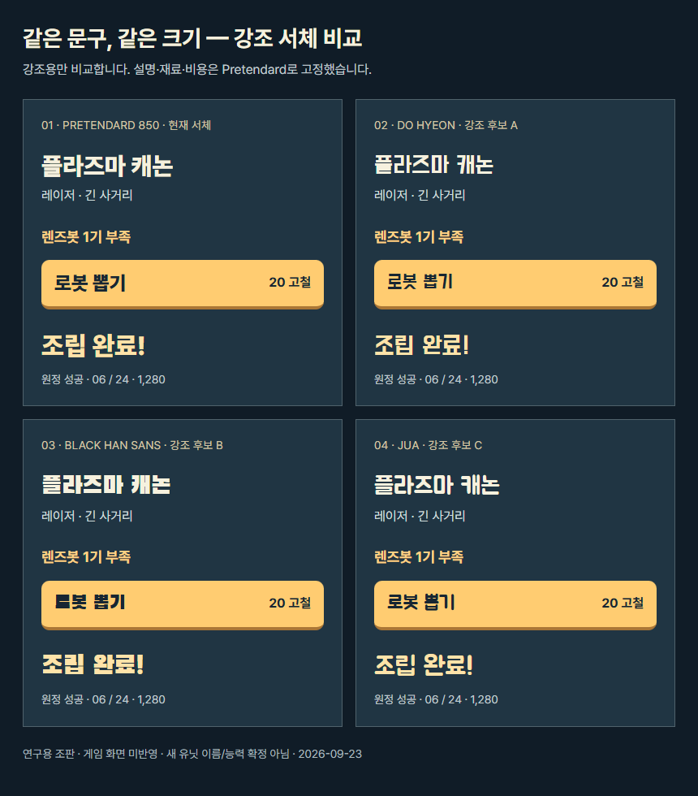

# 모바일 게임 UI 참조 연구: 큰 글자·적은 정보·생활용품의 동작

2026-09-23 · 연구 기준 커밋 `fc66db2` · **사용자의 ‘구현해봐’ 승인 후 브라우저 플레이 시안에 반영했다.** 1~10절은 구현 전 연구 기록이며, 실제 변경·검증 범위는 11절을 따른다.

## 1. 추천 방향

**큼직한 생활용품 로봇, 선명한 행동 버튼, 조용하고 거친 우주 배경.** 친근한 캐릭터와 생존 원정의 분위기를 함께 유지한다. 한 화면에서 먼저 읽어야 할 대상은 2~3개로 정하고, 설명은 그 행동을 선택한 순간에 붙인다.

강조 서체는 **도현체**, 재료·비용·본문·숫자는 기존 **Pretendard** 조합을 첫 비교안으로 추천한다. 아래 실제 조판에서 비교했다. 전체 글씨를 장식 서체로 바꾸거나 제목만 계속 키우는 것은 추천하지 않는다. 현재 홈 제목도 약 67px로 크다. 공간을 차지하는 중복 문구와 작은 동급 정보부터 정리해야 주요 정보를 키울 수 있다.

‘AI 티’는 제작 도구를 판별하는 기준으로 사용하지 않는다. 이번에는 **기성 화면을 조립한 듯한 인상, 장면마다 다른 표현, 읽기 어려운 정보, 목적 없는 반복 동작**을 줄이는 문제로 다룬다.

## 2. 확인한 자료와 한계

- Habby의 궁수의 전설·탕탕특공대, Supercell의 브롤스타즈 공식 Google Play 등록 이미지 **12장**을 내려받아 직접 확인했다. 첫 두 게임 각 5장, 브롤스타즈 2장이다.
- 공식 등록 이미지에는 홍보 제목·캐릭터·합성 구도가 포함된다. 실제 게임 UI가 보이는 영역과 홍보 영역을 구분했다. 이를 현재 설치판의 모든 화면이나 실측 글자 크기로 해석하지 않는다.
- 우리 프로젝트의 홈·행성 선택·유닛 팝업·강화 캡처와 현재 HTML/CSS/렌더링 코드를 검토했다.
- 기존 시각 디자인·모션·소비자 페르소나 팀이 서로 다른 관점에서 재검토했다. **실제 조사 참가자는 0명**이며 찬성률·선호도 통계는 없다.
- 경쟁작의 실시간 플레이 영상을 재생해 타격감이나 시간 간격을 측정하지 않았다. 아래 애니메이션 시간은 우리 게임의 시험 제안이다.

### 참조에서 가져올 것

| 참조 | 확인한 부분 | 우리 게임에 적용할 원칙 | 그대로 옮기지 않을 부분 |
|---|---|---|---|
| [궁수의 전설](https://play.google.com/store/apps/details?id=com.habby.archero&hl=ko) | 능력 선택 화면의 큰 아이콘 3개와 짧은 이름, 배경을 어둡게 눌러 선택지에 집중시키는 구성 | 조립 결과·역할·필요 행동을 크게. 선택하지 않은 상세는 뒤로 보낸다 | 홍보 이미지의 큰 제목을 실제 HUD 크기로 간주하지 않는다. 펫 목록처럼 복잡한 화면도 있으므로 게임 전체가 단순하다고 일반화하지 않는다 |
| [탕탕특공대](https://play.google.com/store/apps/details?id=com.dxx.firenow&hl=ko) | 스킬 선택 카드의 무기 그림·이름·짧은 효과 설명, 특성 목록과 선택 항목의 설명 말풍선 | 목록에서는 종류를 찾고, 선택한 항목에서 효과를 읽게 한다. ‘강화 +10%’처럼 변화량을 앞에 둔다 | 정지 화면만으로 터치/호버 동작을 단정하지 않는다. 홍보용 룰렛·캐릭터 겹침·섬광을 우리 UI에 추가할 이유는 없다 |
| [브롤스타즈](https://play.google.com/store/apps/details?id=com.supercell.brawlstars&hl=ko) | 등록 이미지의 굵은 제목과 선명한 캐릭터 실루엣, 전투 삽입 이미지의 색 구별 | 작은 크기에서도 생활용품 몸체와 기능을 구별하게 한다. 제목과 주요 버튼에 확실한 무게를 준다 | 확인한 자료는 로비 UI 연구가 아니다. 캐릭터·서체·색 배치를 복제하지 않는다 |

판단에 직접 사용한 선택 화면: [궁수의 전설 능력 선택](https://play-lh.googleusercontent.com/BB6skILUNFN6r4SIYzUL8YoxYUCQntjOvzDt-BvMd9t8-XZsm6evPjVVg6w_gkaIUkAE-DmU3-cNEChvUN-5Dw=w720), [탕탕특공대 스킬 선택](https://play-lh.googleusercontent.com/KnzKSzHzzS0gsDz_DkTSs36FzT0vXutyexMgfXC2emvlBdxvwbfBdaJCLmuln5hGIF53Rgk_4OjepL-qB4nh=w720), [탕탕특공대 특성 설명](https://play-lh.googleusercontent.com/u9b3hUtFtQ2WRcF3l4QBeqG1lvhcXtyjCGK6eFku_vUj2NoWdam_rZHtItWr22HMns80aw8-MF9GjOvFeeTpQA=w720). 홍보용 합성 영역은 평가에서 제외했다.

공식 스토어에 실린 구성은 참고 근거이며, 그 구성이 흥행의 원인이라는 증거는 아니다. 내려받은 경쟁작 이미지 12장은 `artifacts/reference-2026-09-23/`에만 두고 제품 자산과 Git에는 포함하지 않았다.

## 3. 현재 화면에서 먼저 해결할 것

| 확인된 상태 | 다음 개편에서의 처리 |
|---|---|
| 홈은 큰 제목 아래 작은 상태 안내와 보조 정보가 많다. ‘출발 전 장비 점검 중’은 실제 진행 상태를 뜻하지 않는다 | 주 행동·연구/함께하기 동선을 남기고 장식용 상태 문장은 생략한다 |
| 390px 행성 선택에서 작은 카드 3개와 아래 선택 요약에 행성명·시간·보상이 반복된다 | 선택한 행성을 큰 한 장으로 보여주고 전환 화살표·목록으로 다른 행성에 접근한다. 스와이프는 추가 수단이다 |
| 유닛 팝업에 부족 문구와 재료 표시가 겹치고 관리 행동들이 한꺼번에 경쟁한다 | 역할·조립 결과·부족 재료 한 표현·조립 행동을 먼저 배치한다. 판매/파견은 이름 있는 관리 진입점에서 접근한다 |
| 로봇 수가 HUD와 뽑기 주변에서 반복된다 | 배치 수/상한을 한 곳에 남긴다. 공간 부족 원인은 뽑기 버튼 근처에서 즉시 알 수 있어야 한다 |
| 보스 제한시간은 계산되지만 `#next-wave`가 10px다 | 최종 보스가 등장하면 제한시간을 중요한 위험 수치로 승격한다 |
| 과밀 남은 시간이 `app.js`의 `#threat-label`, `#battle-rule`에 계산되지만 각각 `visually-hidden`, `display:none`으로 표시된다 | **P0: 과밀 위험 동안 감소하는 시간을 계속 보이게 한다.** 현재 적 수·위험색 표시는 남아 있으므로 ‘경고가 전혀 없다’는 뜻은 아니다 |

마지막 두 항목의 근거: [app.js](../../playtest/app.js)의 HUD 갱신, [index.html](../../playtest/index.html)의 `threat-label`, [mobile-game.css](../../playtest/mobile-game.css)의 `.arena-footer` 규칙. 과밀 진입 알림은 약 2.8초 뒤 사라지고, 현재 과밀 허용 시간은 5초다. **설명 감축 과정에서도 비용·실패까지 남은 시간·실제 행동 결과는 숨기지 않는다.** 이 연구에서 결함을 수정한 것은 아니다.

## 4. 시각 방향 후보

| 방향 | 장점 | 비용/약점 | 판단 |
|---|---|---|---|
| 선명한 장난감 액션 | 생활용품 몸체, 굵은 짧은 제목, 단단한 버튼이 조립·수집과 어울린다. 거친 배경과 친근한 전경을 함께 쓸 수 있다 | 모든 곳에 두꺼운 외곽선·원색을 넣으면 산만하다 | **추천. 주 행동과 캐릭터에 집중 적용** |
| 정비소 작업판 | 라벨·숫자·도구 표현이 폐품 설정과 잘 맞는다 | 회색 패널과 작은 계기판을 늘리면 현재 관리 화면 인상이 강해진다 | 연구소/상세 화면에 일부 활용 |
| 레트로 픽셀 | 뚜렷한 스타일을 만들 수 있다 | 작은 한글, 확대 배율, 전체 캐릭터·배경 재제작 부담 | 현재 범위에서는 보류 |

배경의 질감·먼 행성은 유지하되 버튼 뒤에는 복잡한 무늬를 줄인다. 노란색은 주요 행동/보상, 붉은색은 위험에 우선 배정한다. 속성은 색뿐 아니라 불꽃·바람·눈송이·광선 형태와 짧은 이름으로 구별한다. 나사·녹·광택·외곽선을 모든 패널에 반복하지 않는다.

## 5. 실제 글꼴 비교와 크기 제안

강조 부분만 바꾸고 설명·재료·비용은 동일한 Pretendard로 고정했다. 제목 30px, 버튼 이름 24px, 이벤트 32px다. 예시 ‘플라즈마 캐논’은 조판용이며 유닛 이름·능력을 확정한 것이 아니다.

| 후보 | 이번 조판에서의 판단 | 제안 용도 |
|---|---|---|
| Pretendard 850 | 잘 읽히고 현재 코드와 이어진다. 자체 개성보다 레이아웃에 인상이 좌우된다 | 기준안, 본문·재료·수치 |
| 도현체 / Do Hyeon 400 | 각진 짧은 제목이 생활용품 기계의 분위기와 맞고 조판에서 단어 구별이 쉽다 | **제목·주요 버튼의 첫 비교안** |
| 검은고딕 / Black Han Sans 400 | 같은 크기에서 검은 면적이 강하다. 24px 버튼에서는 획이 뭉쳐 보일 가능성을 확인해야 한다 | 큰 성공/실패 제목의 대안. 본문에는 사용하지 않는다 |
| 주아체 / Jua 400 | 둥글고 부드러워 장난감 인상을 더 준다 | 친근함을 더 강조하는 대안. 거친 원정 분위기와의 균형 확인 |

위 판단은 실제 이용자 선호 결과가 아니다. **본문 1종 + 강조 1종**만 제품 후보로 삼는다. 검은고딕을 별도 세 번째 서체로 추가하는 제안이 아니다. 표시용 세 후보는 원래 weight 400으로 비교했으며 가짜 굵기를 적용하지 않았다. 굵은 외곽선은 큰 제목에만 시험하고, 작은 본문과 수량에는 쓰지 않는다.

390px 세로 화면에서 시작할 **우리 프로젝트의 시험값**이다. 경쟁작 실측이나 플랫폼 표준 수치가 아니다.

| 요소 | 첫 시험 크기 | 공간을 확보하는 방법 |
|---|---|---|
| 홈 로고 | 56~64px | 현재 큰 로고를 더 키우지 않고 주변 문구를 정리 |
| 행성 이름/화면 제목 | 28px | 선택한 행성 한 장에 집중 |
| 출발 같은 주 버튼 | 22~24px, 높이 약 64px | 행동명 한 개, 보조 설명 분리 |
| 전장 로봇 뽑기 | 이름 18px / 비용 16px, 약 136×68px | 배경 위 오른쪽 아래 위치 유지 |
| 선택 유닛 이름 | 20~22px | 등급/분류를 제목과 나란히 늘어놓지 않음 |
| 부족 재료/강화 효과 | 16~18px | 같은 뜻의 문장·재료 칩 중 하나만 우선 노출 |
| 필수 설명 / 부차 설명 | 16px / 13~14px | 부차 설명은 상세에서 열어봄 |
| 위험 수치 / 의미 있는 시간 | 24~28px / 18px | 정상 상태의 장식 문구를 대체 |

360px 세로·작은 가로 화면에서는 정보 묶음을 나누며, 모든 글씨를 다시 작게 만드는 방식으로 맞추지 않는다. 44px 이상 조작 영역과 안전 영역을 유지한다. 폰트 로딩·줄바꿈·한글과 숫자의 혼용은 실제 화면별로 검증해야 한다.

출처: [도현체](https://github.com/google/fonts/tree/main/ofl/dohyeon), [검은고딕](https://github.com/google/fonts/tree/main/ofl/blackhansans), [주아체](https://fonts.google.com/specimen/Jua). 내려받은 각 파일의 [도현체 OFL](https://raw.githubusercontent.com/google/fonts/main/ofl/dohyeon/OFL.txt), [검은고딕 OFL](https://raw.githubusercontent.com/google/fonts/main/ofl/blackhansans/OFL.txt), [주아체 OFL](https://raw.githubusercontent.com/google/fonts/main/ofl/jua/OFL.txt)를 확인했다. 실제 제품 채택 시 해당 라이선스를 자산에 함께 포함한다. 이번 Git 변경에는 연구용 이미지 한 장만 포함하고 후보 폰트 파일을 추가하지 않는다.

## 6. 정보를 언제 보여줄 것인가

| 노출 방식 | 해당 정보 | 조건 |
|---|---|---|
| 관련 화면에서 항상 | 비용/잔액, 현재 목표, 배치 상한, 부족 재료, 조립에 소비되는 대상, 영구/이번 판 효과 구분 | 행동 전에 결과를 알 수 있어야 한다. 모든 정보를 모든 화면에 상시 표시한다는 뜻은 아니다 |
| 해당 상태가 끝날 때까지 | 과밀 남은 시간, 시설 체력 위험, 보스 제한, 연결 끊김/처리 중 | 중요한 경고는 짧은 토스트만으로 끝내지 않는다. 색과 글자/숫자를 함께 사용 |
| 잠깐 | 정상 웨이브 시작, 로봇 등장, 조립 성공, 연결 복구 | 결과는 로봇/재화/현재 상태로 다시 확인 가능해야 한다 |
| 탭해서 상세 | DPS·확률·분류·전체 조합 경로·다른 사용처·상세 보상 | ‘상세’나 정보 아이콘을 통해 발견 가능하게 한다 |
| 마우스 올림/길게 누름 | 위 상세의 빠른 미리보기 | 필수 접근 경로로 삼지 않는다. 길게 누르기로 판매·뽑기·파견을 실행하지 않는다 |

휴대폰에는 일반적인 마우스 호버가 없다. 데스크톱 미리보기는 [CSS hover capability](https://developer.mozilla.org/en-US/docs/Web/CSS/Reference/At-rules/@media/hover)에 맞춰 추가하고, 동일한 정보의 탭/키보드 접근을 남긴다.

## 7. 화면별 다음 시안

### 홈

로봇과 원정선 장면 → 큰 ‘행성 선택’ → 보조 ‘함께하기’·‘연구소’ 순서. 실제 진행과 관련 없는 점검 문장을 지운다. 재화는 사용처와 연결되는 한 묶음으로 둔다. 기능이 없는 상점·업그레이드 탭을 먼저 만들지 않는다.

### 행성 선택

큰 행성 한 장에 **이름 → 현재 목표 → 주요 실패 조건 → 출발**을 모은다. 예상/제한 시간과 보상은 각각 한 번만 표시한다. 다른 행성은 화살표와 목록으로 선택한다. 잠금 이유·연습 모드/보상 없음은 행동 전에 보인다. 미구현인 새 5/10/15분 시간표를 현재 규칙처럼 표시하지 않는다.

### 전장

위쪽에는 목표·재화·현재 위험, 오른쪽 아래에는 로봇 뽑기를 둔다. 평시에는 조용하게 두고 위험 때 같은 자리의 숫자와 문구를 승격한다. ‘과밀 · 3.2초’, ‘채굴기 18%’처럼 상태와 의미를 같이 표시한다. 정상 웨이브 안내가 중요한 적이나 조립을 가리지 않게 한다. 협동 표시는 모드/스토리 상태를 기준으로 하며, 접속자가 현재 1명이라는 이유만으로 숨기지 않는다.

### 유닛 상자

예시 정보 순서: **이름 → ‘화염 · 근거리’ → 다음 조립 결과 → ‘렌즈봇 1기 부족’ → 조립 버튼**. 부족 문구와 같은 내용을 재료 칩·긴 문장으로 중복하지 않는다. 조립 가능하면 실제 소모 수량과 선택 위치 유지가 짧게 보인다. 예: ‘2기 소모 · 이 자리에서 조립’의 수량은 실제 조합에서 가져온다.

유닛 상자는 전장 위에 겹치고 최대 30dvh를 지킨다. 390×844에서 약 366×220px인 요약 시안을 먼저 비교한다. 360×640에서는 한 상자에 긴 조합표까지 넣지 않고 명시적인 상세 전환을 쓴다. 본문을 줄이기 위해 비용·소모를 상세로 밀어내지 않는다. 판매·파견은 이름이 보이는 관리 동선으로 계속 접근할 수 있어야 한다.

### 강화/연구

강화: **‘공격력 +10%’ → 적용 대상 → 비용 → 강화**, ‘이번 원정’ 범위를 짧게 남긴다. 연구: **해금할 조합 → 조건/비용 → 영구 해금**. 다음 원정부터 반영되는 규칙도 유지한다. 장식용 설명은 제거하고 행동 결과를 앞세운다. 수치는 설명용 예시이며 밸런스 변경 제안이 아니다.

## 8. 애니메이션 연구를 다음 실험으로 연결하기

현재 홈 3기는 같은 16초 주기의 3자세 패턴을 시간차로 사용한다. 전투는 준비·사격 후 기본 자세로 돌아가며, 반동 복원 계산과 별개로 **공격 후 복귀 전용 그림**이 없다. 일반 웨이브에도 중앙 알림과 소리가 반복된다. 알림 요소에는 CSS `wave-arrival`과 JS `.animate()`의 두 진입 동작이 걸려 있다. 근거: [home-crew.js](../../playtest/home-crew.js), [mobile-game.css](../../playtest/mobile-game.css), [battlefield.js](../../playtest/battlefield.js), [app.js](../../playtest/app.js), [casual-ui.css](../../playtest/casual-ui.css).

| 대상 | 제안 | 먼저 확인할 것 |
|---|---|---|
| 라이터 | 뚜껑 열기 → 점화 → 불 끄기 → 열린 채 짧게 복귀. 연속 공격마다 뚜껑을 닫지 않는다 | 대표 1종에 복귀 자세 하나를 추가한 비교 영상부터 만든다 |
| 드라이어 | 스위치·팬 가속·버티는 자세·팬 감속 | 실제 능력에 없는 적 밀치기를 연출로 암시하지 않는다 |
| 레이저포인터 | 조준 → 렌즈 점등 → 소등 후 조준 유지 | 긴 사거리/단일 타격이 읽히고 총구 방향이 대상과 맞는지 |
| 홈 | 각 물건에 맞는 드문 점검 행동 | 모두 동시에 같은 주기로 흔들리지 않음. 출발 입력은 항상 가능 |
| 뽑기 / 조립 | 뽑기는 새 로봇의 착지, 조립은 선택한 자리의 체결·시동 | 서버가 승인한 행동과 위치로 구분. 새 로봇 발견만으로 조립을 추정하면 재접속 등에서 틀릴 수 있음 |
| 알림 | 진입 동작 담당을 하나로 정하고, 일반 웨이브와 위험/특별 완성을 구별 | 위험 문구는 유지하고 반복되는 큰 연출만 줄임 |

첫 시험 범위는 버튼 눌림 60~90ms, 뽑기 착지 250~350ms, 조립 체결·시동 300~450ms다. **경쟁작을 측정한 값이 아니다.** 눌림 피드백과 서버 처리 완료를 구분하고, 연출 때문에 조작·전투를 멈추지 않는다. 입력을 막는 긴 축하창이나 협동 전체의 정지는 넣지 않는다. 피해·감속·발사 간격은 서버 상태를 그대로 따른다. 동작 줄이기·무음 상태에서도 같은 위험과 결과가 보인다.

모든 29종의 그림을 한꺼번에 늘리지 않는다. 대표 라이터의 정지→준비→타격→복귀 비교를 실제 휴대폰에서 본 후 나머지 두 종으로 넓힌다.

## 9. 다음 구현 순서와 통과 기준

1. **위험 정보·중복 설명 정리** → 과밀 남은 시간이 위험 해소/패배까지 보이고, 보스 제한·시설 위험·비용·소모가 누락되지 않는지 검증.
2. **행성 한 장과 유닛 요약 시안** → 360×640, 390×844, 667×375 및 안전 영역에서 글자 잘림 없음, 조작 영역 44px 이상, 유닛 상자 30dvh 이하, 선택 전후 전장 크기 유지.
3. **도현체+Pretendard 적용 비교** → 홈·행성·유닛 세 화면에서 같은 내용과 크기로 비교. 후보를 나란히 섞지 않고 한 안씩 평가.
4. **라이터 복귀·뽑기/조립·알림 연출** → 승인된 행동과 렌더링 이벤트 대응, 서버 전투 속도/능력/위치 보존. 평온/밀집 전투의 실제 폰 영상에서 확인.
5. **실제 이용자 확인** → 처음 본 사람이 5초 안에 시작/뽑기 동선을 찾는지, 조립 불가 이유·소모 대상·임박한 패배를 설명할 수 있는지 관찰. 이는 목표이며 달성한 조사 수치가 아니다.

동작 검증에서는 무음/소리 켬/동작 줄이기를 각각 확인한다. 기존 게임 회귀 검사는 코드 구현 때 해당 범위에 맞춰 실행한다. 이번 문서 작업에서 과거의 112개 게임 검사 결과를 새 검증 결과로 재사용하지 않는다.

## 10. 이번 연구 산출물 검증

- 브라우저에서 기존 Pretendard와 세 후보 폰트가 모두 `loaded`인 것을 확인했다.
- 860px 비교판에서 가로 넘침과 강조 문구의 가로 잘림이 없음을 검사하고 PNG를 직접 확인했다. 실제 360px 게임 화면의 폰트 적용 검증은 아직 아니다.
- 비교판 HTML·실행 스크립트·다운로드 원본·결과 JSON은 `artifacts/reference-2026-09-23/`에 있다. 커밋에는 본 문서와 완성된 비교 PNG를 남긴다.
- 게임 코드·확률·능력치·저장 데이터·런타임 자산은 변경하지 않았다. 실제 휴대폰 체감·경쟁작 모션 측정·소비자 선호 검증은 남아 있다.

## 11. 승인 후 구현 기록

### 화면과 정보

- 로컬 도현체를 제목·주요 행동에 적용했다. 네이티브 weight 400으로 쓰며, 본문·재료·비용·수치는 Pretendard다. 원본 TTF·OFL·출처·SHA-256을 자산 대장에 보관했다.
- 홈의 장식용 점검 상태와 보조 슬로건을 없앴다. 생활용품 장면과 큰 ‘행성 선택’, 연구/함께하기 동선을 남겼다.
- 행성 선택은 큰 행성 한 장, 이전/다음 화살표, 탭해서 여는 목록으로 바꿨다. 잠긴 행성도 목표와 잠금 이유를 미리 볼 수 있고 출발은 차단한다. 목표/위험/시간을 한 번씩 표시하고 배경 설명은 ‘행성 정보’에서 펼친다. 보상 유무는 원정 설정의 현재 모드에서 항상 확인한다.
- 유닛 요약은 이름 22px, 역할 16px, 조립 결과 20px, 부족 재료 16px로 정리했다. 재료 칩 중복을 없애고 실제 소모 수량·선택 위치 유지·조립 행동을 남겼다. 여러 조립 후보는 가로 넘김과 ‘다음 조립’ 버튼 모두로 접근한다.
- ‘관리·상세’와 조립의 ‘상세’는 명시적인 별도 모달로 연다. 판매 확인·파견 대기·분류·피해량·재료 수량·전체 경로는 여기서 확인한다. 상세를 닫으면 요약으로 돌아가고 유닛 소모/판매 시 상세도 닫힌다. 마우스 호버 없이 터치만으로 모든 필수 정보를 볼 수 있다.
- 전장 위 선택 요약은 30dvh 이하이며 전장 크기는 바뀌지 않는다. 명시적으로 연 상세 모달은 더 넓은 공간에서 스크롤한다. 작은 가로 화면은 선택 요약을 두 열로 배치한다. 팝업이 다른 로봇 일부를 덮을 수 있으므로 닫기·로봇 목록 경로도 유지한다.
- 강화 효과는 24px, 뽑기는 행동명 20px/비용 16px로 키웠다. 강화의 적용 대상·이번 원정 범위·비용과 연구의 영구 해금 조건은 유지했다.
- 과밀 남은 초는 위험 동안 24px로 계속 표시하고 해소/종료 시 내린다. 시설 체력 위험을 같은 위치에서 표시한다. 보스 제한시간은 보스 체력 아래 18px로 유지한다. 중복된 로봇 수 배지와 정상 상태 문구를 줄였다.

### 동작

- 라이터에 불이 꺼지고 뚜껑은 열린 복귀 자세 하나를 추가했다. 확인된 연속 공격 사이에는 열린 상태를 유지하고 쉬면 닫는다. 다른 28종의 복귀 그림을 새로 만든 것은 아니다.
- 홈의 라이터는 열기·점화·소등/복귀, 드라이어/포인터는 준비·작동·잔회전/조준 유지 후 대기로 돌아간다. 발생 시간을 나누고 동작 줄이기에서는 정지 자세를 유지한다.
- 실제 행동 승인 후 `markArrival()`를 연결했다. 뽑기는 300ms 착지, 조립은 선택한 원래 위치에서 400ms 체결이다. 초기 접속·재접속·다른 구역 관전으로 표시가 넘어가거나 과거 행동이 다시 재생되지 않게 했다.
- 일반 웨이브는 작은 900ms 알림으로 줄이고 반복 경보음을 제거했다. 알림 진입은 JS 한 곳에서 관리한다. 위험의 숫자 표시는 이 일시적인 알림 수명과 독립적이다.

### 검증과 제한

- `npm.cmd test`: 콘텐츠 검증·빌드와 **116개 테스트 통과**. 라이터 복귀/캐시, 승인된 뽑기와 조립의 구분, 관전/재접속 표시 누출 방지 검사를 포함한다.
- `test:flow`: **10개 시나리오 통과**. 다섯 화면 크기의 홈/행성/전투 흐름, 폰트 실제 로딩, 잠금 미리보기와 출발 차단, 시설 방어, 과밀 경고의 유지·감소·해소, 보스 제한 표시를 검증했다.
- `test:combat`: **8개 검사 통과**. 실제 조립 요청→재료 소모·선택 위치→한 번의 400ms 체결 표시를 확인하고 전투·웨이브·보스·무음/동작 줄이기를 확인했다. 오래 표시되는 중앙 조립 배너를 전제로 하던 검사는 새 전장 체결 표시를 직접 관찰하도록 바꿨다.
- `test:quality`, `test:expedition`도 통과했다. 원정 검사의 전체 조립 경로 사례는 랜덤 첫 재고에 따라 하위 가지가 접히는 기존 불안정성을 빈 재고의 명시적 시험 조건으로 고쳤다. 재화·재료·위치·보상 중복 방지·4인 참가 검증은 유지했다.
- 390×844, 360×640, 667×375의 홈·행성·요약·상세·강화 캡처를 직접 확인했다. 기존 CSS에 남아 있던 행성 높이와 강화 글자 크기를 보정했다. 관련 캡처는 `artifacts/ui-*-*.png`, 결과는 `artifacts/ui-inspection-2026-09-23.json`에 있다.
- 모바일 배치는 **7규격·358개 검사**, 위치/속성은 **3규격** 모두 통과했다. 요약창 위치를 실제 전장·버튼·선택 로봇 좌표로 계산해 가로 화면의 중심 가림을 고쳤다. 작은 가로 화면에서는 머리나 하체 일부가 안내와 겹칠 수 있다.
- JEV용 스크립트 baseline은 **9/9 통과**, 실제 JEV·모델·API 호출은 0회다. 모드 안내 검사는 중복을 없애고 남긴 `#run-mode-label`을 확인하도록 갱신했다.
- 브라우저 구현이다. 서버 능력치·확률·조합식·콘텐츠 버전과 기존 모드 규칙은 바꾸지 않았다. Unity 이식, 실제 휴대폰 성능/체감, 경쟁작 모션 실측, 실제 소비자 비교는 아직 하지 않았다. Playwright 결과를 실제 JEV/AI 실행이나 이용자 조사로 보고하지 않는다.
